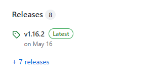
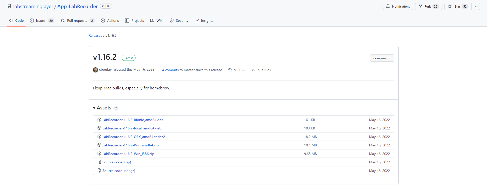
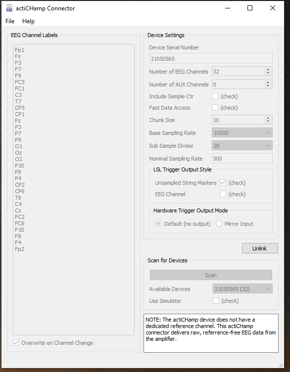
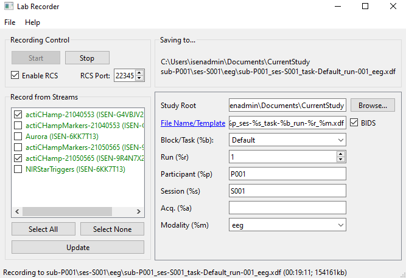
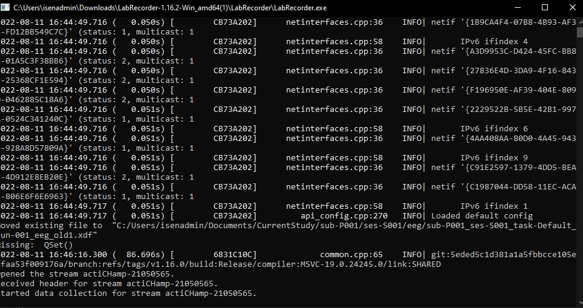
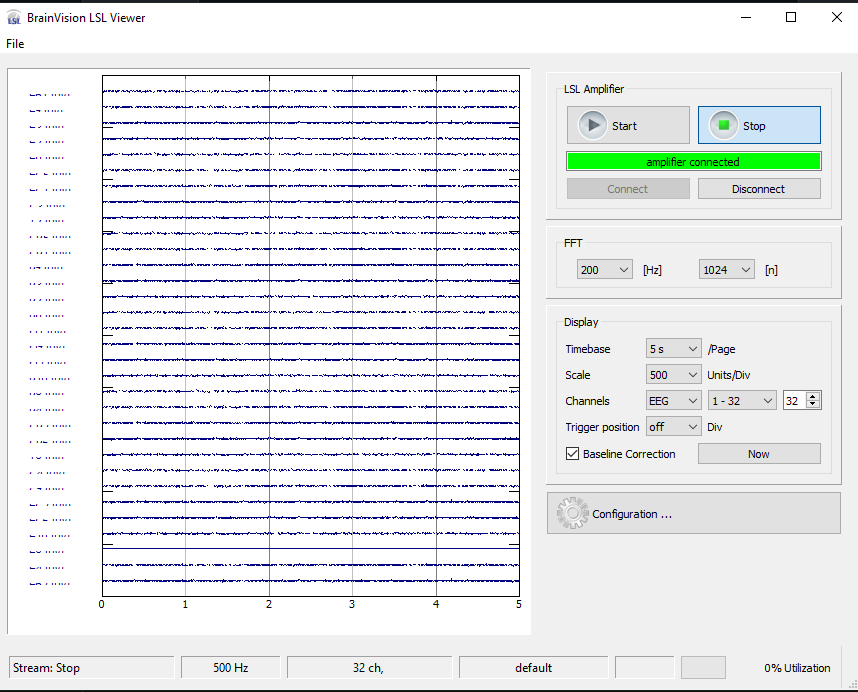
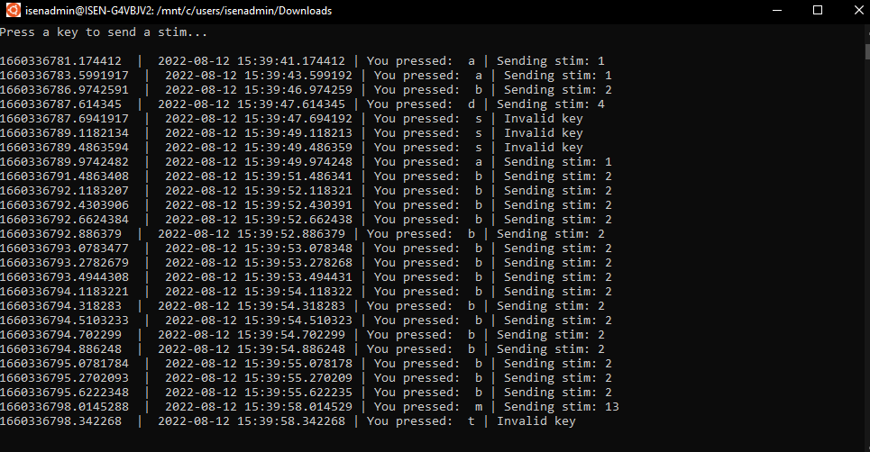

# LSL_EEG
## Installation
Please ensure you have installed the neccessary packages.
 * [Lab Recorder](https://github.com/labstreaminglayer/App-LabRecorder)
    * Please pan over to the releases section and click on the latest release.
    

    * You will be taken to this page, plese download the appropriate version.
    
    

  
## Startup

* Please open the LSL Connector application, you should see this view.
    * Click on the scan bottom and the connector will search for your actiCHamp.
    * Once the Connector finds a ActiChamp, please confirm that it is the correct one; then select `Link`. 
    
* Now please open the LSL Recorder application.
    * You should see this view.
    * Select the actiChamp devices you wish to record.
    * Click on the `Start` button.
    * You will see the Recorder Terminal view state that the recording has started.
    
    
* Please Open the LSL Viewer application.
    * Click on the `Connect` button.
    * Click on the `Start` button.
    * You will see the data stream coming into the Viewer.
    

* Open Ubuntu for Windows.
    * Perform the following commands.

     `cd ../../../../mnt/` 
    * Now `cd` to the directory path that contains the `EEGLSL.py` file.
    * `python EEGLSL.py`
    * You should see this.
        
