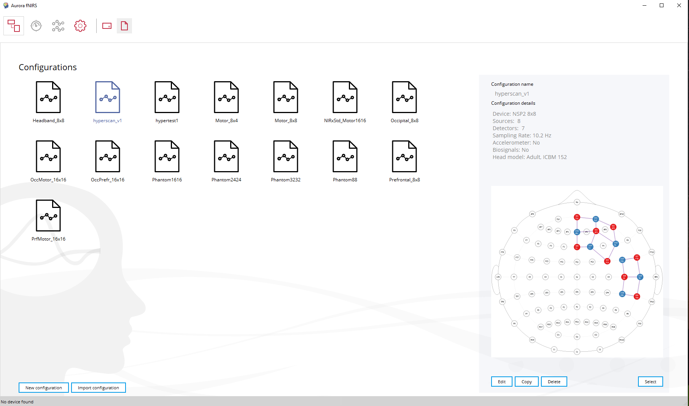
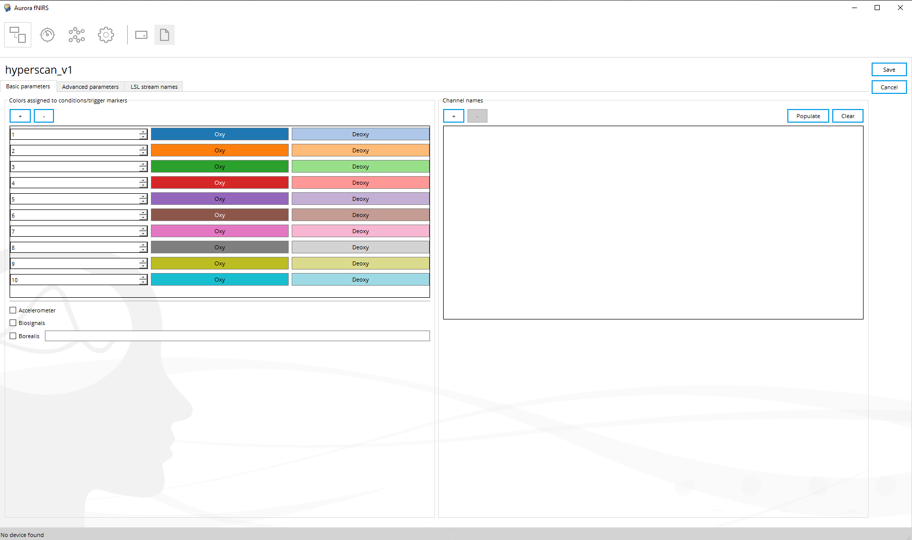
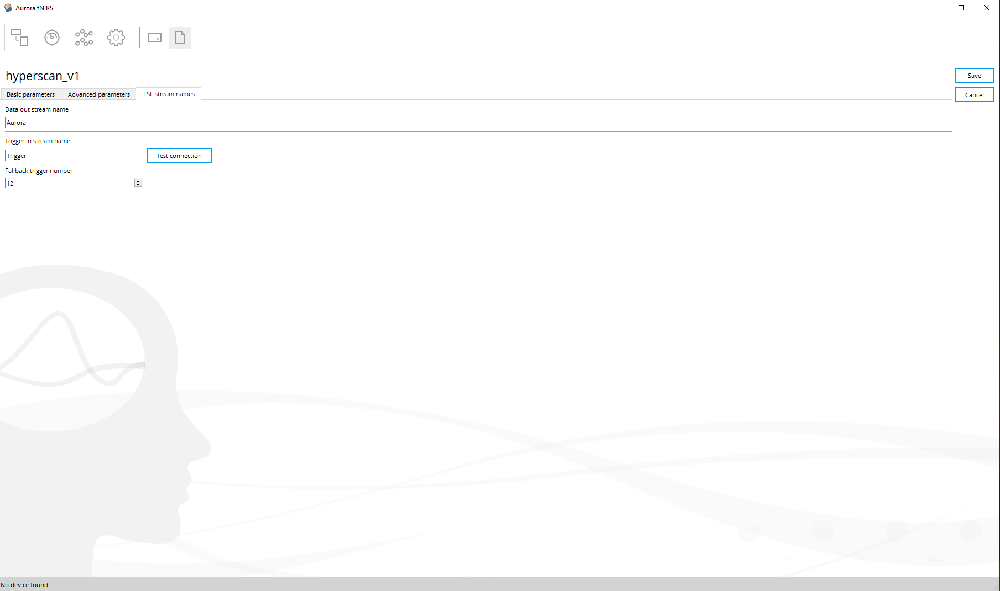
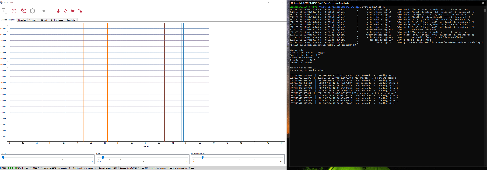

# LSL integration
Lab Streaming Layer for fNIRS, EEG, ... and what not.

author: [@nimrobotics](https://twitter.com/nimrobotics)

# Installation

* Install [Windows Subsystem for Linux](https://docs.microsoft.com/en-us/windows/wsl/about) as this pipline is based on Linux. Below two versions have been tested.
    * Ubuntu 18.04 LTS (Bionic)
    * Ubuntu 20.04 LTS (Focal)
* Install the core LSL library
    * Download the latest version (*.deb) from GitHub [LSL library](https://github.com/sccn/liblsl) from the releases page.
    * Switch to the directory where the *.deb is located.
    * Change permissions to `chmod +x *.deb`
    * Install the *.deb `sudo dpkg -i liblsl-bin_*.deb`
* Install the python binding [pylsl](https://github.com/labstreaminglayer/liblsl-Python)
    * `pip3 install pylsl`

# Usage

1. Run the following command to start the streamer:
    * `python3 streamer.py`
    * Alter the parameters in the example progam if needed.
2. Open Aurora on Windows and connect with the fNIRS device.
3. On the configuration page, select the desired probmap and click `Edit` as shown in the image below.
    
4. In the `Basic parameters` tab, add triggers (ideally, the same number as defined in the `streamer.py` program).
    
5. Verify that the `Data out stream name` and `Data in stream name` same as defined in the `streamer.py` program.
    
6. Now you should be able to see the data with triggers in the Aurora console.
    
7. The trigger input may be automated to your needs.

# Caveats
* A few times the LSL stims were not placed on the fNIRS recordings when the fNIRS was connected using a cable. Although, the fNIRS data was transmitted over the wired connection, team T2D suspects that it was a problem with the cable.